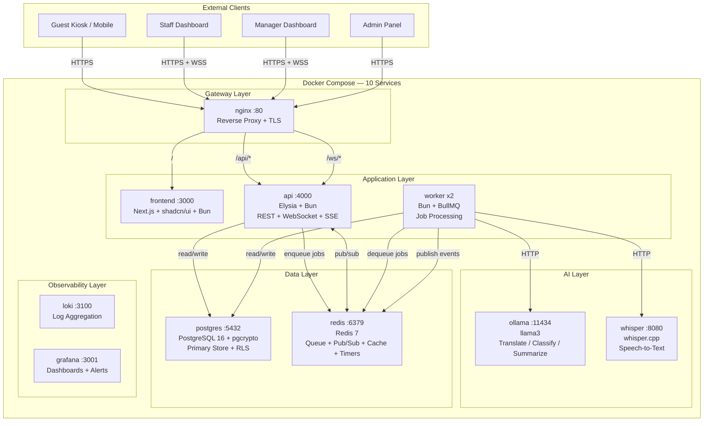

# HospiQ — Real-Time AI-Powered Hospitality Workflow System

> Guests speak any language. AI understands, classifies, and routes. Staff resolves in real-time.

## Overview

HospiQ is a real-time AI-powered workflow system for the hospitality industry. Guests submit requests via voice or text — in any language — through a hotel kiosk or mobile device. The system transcribes speech with Whisper.cpp, translates and classifies urgency with a local LLM (Ollama/llama3), and routes the request to the correct department. All of this happens without any cloud API keys, keeping guest data entirely private and the setup frictionless.

Staff see tasks appear instantly on a live Kanban dashboard with SLA countdown timers. They claim, resolve, or escalate requests in real-time. If an SLA is breached, the system auto-escalates to management with tiered urgency. Managers monitor operations through a D3-powered analytics command center with stream graphs, department gauges, AI confidence histograms, and SLA compliance tracking.

The entire system runs as 10 Docker Compose services — gateway, frontend, API, workers, AI engines, database, cache, and observability — designed for horizontal scaling and graceful fault tolerance. One `docker compose up` and you're running a production-grade hospitality platform.

## Architecture



## Quick Start

```bash
git clone <repo> && cd hospiq
./scripts/setup.sh
```

Open http://localhost in your browser. Visit `/demo` for guided exploration.

## Demo Accounts

| Role | Email | Password |
|------|-------|----------|
| Guest | guest@demo.hospiq.com | demo2026 |
| Staff (Maintenance) | juan@hotel-mariana.com | demo2026 |
| Staff (Housekeeping) | ana@hotel-mariana.com | demo2026 |
| Manager | maria@hotel-mariana.com | demo2026 |
| Admin | admin@hotel-mariana.com | demo2026 |

## Views

### Guest Kiosk (`/`)
Submit requests via text or voice in any language. Watch real-time progress as your request is transcribed, classified, and routed.

### Staff Dashboard (`/dashboard`)
Kanban board with real-time WebSocket updates. Claim, resolve, escalate. SLA countdown timers on every card.

### Manager Analytics (`/analytics`)
D3 visualizations: stream graph of request volume, department workload gauges, AI confidence histogram, SLA compliance tracking.

### Manager Escalation (`/manager`)
Escalation center for SLA breaches. Override AI classifications. Tiered escalation with configurable timeouts.

### Admin Settings (`/admin`)
Departments, users, rooms, integrations, audit log. Full RBAC and multi-tenant configuration.

## Running the Simulation

```bash
bun scripts/simulate.ts
```

Fires random multilingual requests every 5 seconds. Open the staff dashboard alongside to watch requests flow through the system in real-time.

## Tech Stack

| Layer | Technology | Why |
|-------|-----------|-----|
| Frontend | Next.js 15 + shadcn/ui + D3.js | File-based routing, accessible components, custom visualizations |
| API | Elysia on Bun | Native WebSocket, end-to-end type safety, fast HTTP |
| Workers | BullMQ on Bun | Reliable job processing with retries and delayed jobs |
| AI | Ollama (llama3) + Whisper.cpp | Local inference, no API keys, full privacy |
| Database | PostgreSQL 16 + Drizzle ORM | RLS multi-tenancy, pgcrypto encryption, type-safe queries |
| Cache/Queue | Redis 7 | Queue + pub/sub + cache + SLA timers in one service |
| Real-time | WebSocket + SSE | Bidirectional for staff, unidirectional for guests |
| Observability | Grafana + Loki | Lightweight log aggregation and dashboards |

## Project Structure

```
hospiq/
├── apps/
│   ├── frontend/    # Next.js + shadcn/ui + D3
│   ├── api/         # Elysia REST + WebSocket + SSE
│   └── worker/      # BullMQ job processors
├── packages/
│   └── db/          # Drizzle ORM schema + migrations + seed
├── scripts/         # Setup, simulation, QR generation
├── nginx/           # Reverse proxy config
└── docs/            # Architecture, tech decisions
```

## E2E Tests

```bash
cd apps/frontend
bunx playwright test
bunx playwright test --ui  # Visual debugging
```

8 test suites covering guest flow, staff operations, real-time sync, escalation, fault tolerance, analytics, admin, and demo simulation.

## License

MIT
