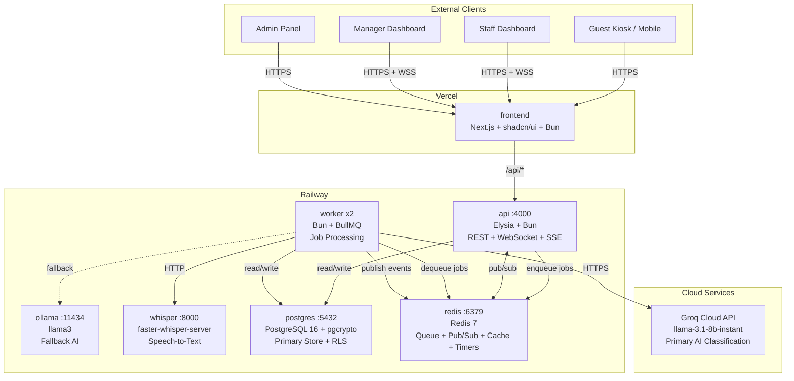

# HospiQ — Real-Time AI-Powered Hospitality Workflow System

> Guests speak any language. AI understands, classifies, and routes. Staff resolves in real-time.

**Production:** [https://hospiq-eight.vercel.app](https://hospiq-eight.vercel.app)

## Overview

HospiQ is a real-time AI-powered workflow system for the hospitality industry. Guests submit requests via voice or text — in any language — through a hotel kiosk or mobile device. The system transcribes speech with Faster Whisper on Railway, translates and classifies urgency with Groq cloud AI (`llama-3.1-8b-instant`, ~500ms classification), and routes the request to the correct department. Ollama is deployed as a fallback for air-gapped or local development environments.

Staff see tasks appear instantly on a live Kanban dashboard with SLA countdown timers. They claim, resolve, or escalate requests in real-time. If an SLA is breached, the system auto-escalates to management with tiered urgency. Managers monitor operations through a D3-powered analytics command center with stream graphs, department gauges, AI confidence histograms, and SLA compliance tracking. The UI is mobile responsive with prefers-reduced-motion support and focus-visible indicators, using a shared AppShell component for consistent sidebar navigation.

The system is deployed with the frontend on Vercel and the backend services (API, Worker, Postgres, Redis, Ollama, Whisper) on Railway. For local development, Docker Compose brings up the full stack.

## Architecture



## Quick Start

### Local Development (Docker Compose)

```bash
git clone <repo> && cd hospiq
./scripts/setup.sh
```

Open http://localhost in your browser. Visit `/demo` for guided exploration.

### Production Deployment

- **Frontend:** Deployed on Vercel at [https://hospiq-eight.vercel.app](https://hospiq-eight.vercel.app)
- **Backend:** Deployed on Railway (API, Worker, Postgres, Redis, Ollama, Whisper)

See the [Deployment](#deployment) section below for details.

## Demo Accounts

| Role | Email | Password |
|------|-------|----------|
| Guest | guest@demo.hospiq.com | demo2026 |
| Staff (Maintenance) | juan@hotel-mariana.com | demo2026 |
| Staff (Housekeeping) | ana@hotel-mariana.com | demo2026 |
| Manager | maria@hotel-mariana.com | demo2026 |
| Admin | admin@hotel-mariana.com | demo2026 |

## Views

### Guest Kiosk (`/`)
Submit requests via text or voice in any language. Voice recording uses tap-to-start/tap-to-stop. Room number is optional (defaults to 101/Lobby). Watch real-time progress as your request is transcribed, classified, and routed.

### Staff Dashboard (`/dashboard`)
Kanban board with real-time WebSocket updates. Claim, resolve, escalate. SLA countdown timers on every card.

### Manager Analytics (`/analytics`)
D3 visualizations: stream graph of request volume, department workload gauges, AI confidence histogram, SLA compliance tracking.

### Manager Escalation (`/manager`)
Escalation center for SLA breaches. Override AI classifications. Tiered escalation with configurable timeouts.

### Admin Settings (`/admin`)
Departments, users, rooms, integrations, audit log. Full RBAC and multi-tenant configuration.

## Running the Simulation

```bash
bun scripts/simulate.ts
```

Fires random multilingual requests every 5 seconds. Open the staff dashboard alongside to watch requests flow through the system in real-time.

## Tech Stack

| Layer | Technology | Why |
|-------|-----------|-----|
| Frontend | Next.js 15 + shadcn/ui + D3.js | File-based routing, accessible components, custom visualizations |
| API | Elysia on Bun | Native WebSocket, end-to-end type safety, fast HTTP |
| Workers | BullMQ on Bun | Reliable job processing with retries and delayed jobs |
| AI (Primary) | Groq Cloud (`llama-3.1-8b-instant`) | ~500ms classification, production-grade speed |
| AI (Fallback) | Ollama (llama3) | Local inference for dev / air-gapped / circuit breaker fallback |
| Speech-to-Text | Faster Whisper (`fedirz/faster-whisper-server`) | Runs on Railway, audio passed as base64 via BullMQ |
| Database | PostgreSQL 16 + Drizzle ORM | RLS multi-tenancy, pgcrypto encryption, type-safe queries |
| Cache/Queue | Redis 7 | Queue + pub/sub + cache + SLA timers in one service |
| Real-time | WebSocket + SSE | Bidirectional for staff, unidirectional for guests |
| Observability | Grafana + Loki | Lightweight log aggregation and dashboards |

## Project Structure

```
hospiq/
├── apps/
│   ├── frontend/    # Next.js + shadcn/ui + D3
│   ├── api/         # Elysia REST + WebSocket + SSE
│   └── worker/      # BullMQ job processors
├── packages/
│   └── db/          # Drizzle ORM schema + migrations + seed
├── scripts/         # Setup, simulation, QR generation
├── nginx/           # Reverse proxy config
└── docs/            # Architecture, tech decisions
```

## Deployment

### Frontend — Vercel

The Next.js frontend is deployed on Vercel at [https://hospiq-eight.vercel.app](https://hospiq-eight.vercel.app). Vercel provides edge CDN, zero-config Next.js hosting, and automatic preview deployments on PRs.

### Backend — Railway

All backend services run on Railway as Docker containers:

| Service | Image / Runtime | Port |
|---------|----------------|------|
| API | Elysia + Bun | 4000 |
| Worker | Bun + BullMQ | — |
| PostgreSQL | PostgreSQL 16 | 5432 |
| Redis | Redis 7 | 6379 |
| Ollama | ollama/ollama | 11434 |
| Whisper | `fedirz/faster-whisper-server:latest-cpu` | 8000 |

### AI Classification — Groq Cloud

Production AI classification uses the Groq cloud API (`llama-3.1-8b-instant`) via `https://api.groq.com/openai/v1/chat/completions`. Classification completes in ~500ms. The circuit breaker pattern provides fallback: Groq -> Ollama -> manual_review.

## E2E Tests

```bash
cd apps/frontend
bunx playwright test
bunx playwright test --ui  # Visual debugging
```

8 test suites covering guest flow, staff operations, real-time sync, escalation, fault tolerance, analytics, admin, and demo simulation.

## License

MIT
