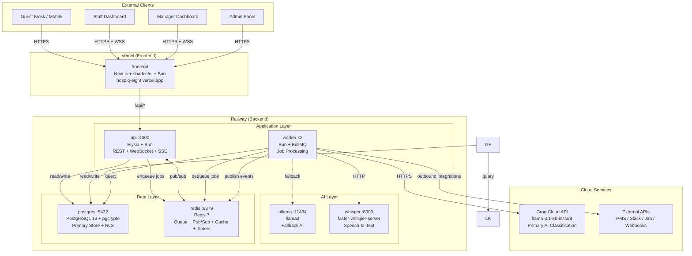

# HospiQ Architecture

## System Overview

HospiQ is deployed with the frontend on Vercel and backend services on Railway (API, Worker, Postgres, Redis, Ollama, Whisper). AI classification uses the Groq cloud API as the primary provider with Ollama as fallback. For local development, Docker Compose brings up the full stack as 10 services.

## Architecture Diagram

> **Note:** For local development, Docker Compose adds nginx as a reverse proxy and Grafana + Loki for observability. The production deployment on Railway/Vercel omits these in favor of platform-native equivalents.

## Service Descriptions

### Gateway Layer (Local Dev Only)

**nginx** — Reverse proxy and TLS terminator for local development. Routes `/` to the frontend, `/api/*` to the Elysia API, and `/ws/*` for WebSocket upgrades. In production, Vercel handles frontend routing and the Railway API is accessed directly.

### Application Layer

**frontend** (Next.js + shadcn/ui + Bun) — Deployed on Vercel at `https://hospiq-eight.vercel.app`. Server-rendered React application serving five views: Guest Kiosk, Staff Dashboard, Manager Analytics, Manager Escalation, and Admin Settings. Uses D3.js for custom analytics visualizations. A shared AppShell component handles responsive sidebar navigation across dashboard, analytics, and manager pages. Mobile responsive with prefers-reduced-motion support and focus-visible indicators. The guest kiosk uses tap-to-start/tap-to-stop voice recording with optional room number (defaults to 101/Lobby).

**api** (Elysia + Bun) — Deployed on Railway. REST API, WebSocket server, and SSE endpoint in a single service. Handles authentication (JWT), request ingestion, workflow management, and real-time event broadcasting via Redis pub/sub.

**worker** (Bun + BullMQ) — Deployed on Railway as 2 replicas. Handles transcription (Whisper), AI classification (Groq primary, Ollama fallback), workflow creation, SLA timer management, escalation checks, and outbound integrations. Voice audio is received as base64 through the BullMQ job queue.

### AI Layer

**Groq Cloud API** (Primary) — Production AI classification using `llama-3.1-8b-instant` via `https://api.groq.com/openai/v1/chat/completions`. Handles translation, urgency classification, department routing, and request summarization. Classification completes in ~500ms.

**ollama** (Fallback) — Deployed on Railway as `llama3`. Serves as fallback when Groq is unavailable (circuit breaker: Groq -> Ollama -> manual_review). Also the default AI provider for local development and air-gapped environments.

**whisper** (Faster Whisper) — Deployed on Railway as `fedirz/faster-whisper-server:latest-cpu` on port 8000. Speech-to-text engine supporting 99 languages. Receives audio as base64 via BullMQ jobs, returns transcription with language detection and confidence scores.

### Data Layer

**postgres** (PostgreSQL 16) — Primary data store with Row Level Security for multi-tenant isolation. Uses pgcrypto for encryption of sensitive guest data. Drizzle ORM provides type-safe schema and migrations.

**redis** (Redis 7) — Serves four roles: BullMQ job queue, pub/sub for real-time events, cache for dashboard stats (10s TTL), and delayed job scheduling for SLA timers.

### Observability Layer

**loki** — Log aggregation service. Receives structured JSON logs from all containers via the Docker logging driver. No sidecar required.

**grafana** — Dashboards and alerting. Queries Loki for log analysis and PostgreSQL directly for operational metrics.

## Data Flow

### Guest Request Lifecycle

1. **Input** — Guest submits a voice or text request through the kiosk (tap-to-start/tap-to-stop for voice, room number optional — defaults to 101/Lobby). The API creates a request record in PostgreSQL and enqueues a transcription job (voice) or classification job (text) to Redis. Voice audio is passed as base64 in the BullMQ job payload.

2. **Transcription** (voice only) — A worker dequeues the job, sends the base64 audio to Faster Whisper on Railway (port 8000), and stores the transcription. The worker then enqueues a classification job.

3. **AI Classification** — A worker sends the text to the Groq cloud API (`llama-3.1-8b-instant`) with a structured prompt. Groq returns: translated text (English), department, urgency level, and a summary in ~500ms. If Groq is unavailable, the circuit breaker falls back to Ollama, then to manual_review. Results are stored in PostgreSQL.

4. **Workflow Creation** — The worker creates a workflow record with an SLA deadline based on urgency and department configuration. A delayed escalation-check job is scheduled in Redis. Real-time events are published via Redis pub/sub.

5. **Staff Assignment** — The API broadcasts the new workflow to connected staff dashboards via WebSocket. Staff claim the workflow, and the guest receives a status update via SSE.

6. **Resolution or Escalation** — Staff resolve the workflow, or the SLA timer fires and the system auto-escalates to management. Each state change creates an audit trail in the workflow_events and audit_log tables.

## Deployment Architecture

### Production

| Component | Platform | URL / Details |
|-----------|----------|---------------|
| Frontend | Vercel | `https://hospiq-eight.vercel.app` — Edge CDN, automatic preview deploys |
| API | Railway | Elysia + Bun, port 4000 |
| Worker | Railway | Bun + BullMQ, 2 replicas |
| PostgreSQL | Railway | Managed PostgreSQL 16 |
| Redis | Railway | Managed Redis 7 |
| Ollama | Railway | `ollama/ollama`, port 11434 (fallback AI) |
| Whisper | Railway | `fedirz/faster-whisper-server:latest-cpu`, port 8000 |
| AI Classification | Groq Cloud | `https://api.groq.com/openai/v1/chat/completions`, `llama-3.1-8b-instant` |

### Local Development

Docker Compose brings up all services locally including nginx (reverse proxy), Grafana, and Loki for observability. Ollama serves as the primary AI provider in local mode (no Groq API key required).

## Scalability Strategy

**Target:** 1000+ organizations, concurrent real-time connections.

| Layer | Strategy |
|---|---|
| **Frontend** | CDN-deployed Next.js. Static assets cached. Server components reduce client bundle. |
| **API** | Stateless Elysia servers behind nginx. Horizontal scale: add replicas. JWT auth = no session affinity needed (except WebSocket — use Redis-backed sticky sessions). |
| **Workers** | `deploy.replicas: N` in Docker Compose. Each worker processes jobs independently. Scale workers = scale throughput linearly. |
| **Database** | Connection pooling (PgBouncer). Read replicas for analytics queries. Partition `audit_log` and `workflow_events` by `created_at`. Indexes on hot query paths. |
| **Redis** | Single instance handles thousands of orgs. Upgrade path: Redis Cluster for sharding. BullMQ supports multi-node Redis. |
| **AI** | Groq cloud API handles production scale. Queue absorbs burst traffic. Circuit breaker provides Groq -> Ollama -> manual_review fallback chain. |

## Fault Tolerance

| Failure | Handling |
|---|---|
| **Groq down** | Circuit breaker opens. Falls back to Ollama on Railway. If Ollama also fails, requests flagged "manual_review". System continues operating. |
| **Ollama down** | Only affects fallback path. If Groq is healthy, no impact. If both are down, requests flagged "manual_review". Staff classifies manually. |
| **Whisper down** | Circuit breaker. Voice requests queued in DLQ. Text requests unaffected. Retry when service recovers. |
| **Redis down** | API returns errors for new requests. Existing data in Postgres still accessible. Dashboard shows stale state with warning. |
| **Postgres down** | System is unavailable. Redis queue holds pending jobs. On recovery, workers drain the queue. No data loss. |
| **Network drop (guest)** | SSE auto-reconnects. Missed updates stored in `notifications` table. On reconnect, flush pending notifications. Poll endpoint as fallback. |
| **Network drop (staff)** | WebSocket auto-reconnects with Elysia. On reconnect, server sends full current queue state. No missed assignments. |
| **Worker crash** | BullMQ detects stalled job and re-queues automatically. Another worker picks it up. At-least-once processing guaranteed. |
| **Integration target down** | 3 retries with exponential backoff. Failed events logged to `integration_events`. Admin sees failure in integration dashboard. Does not block workflow processing. |
