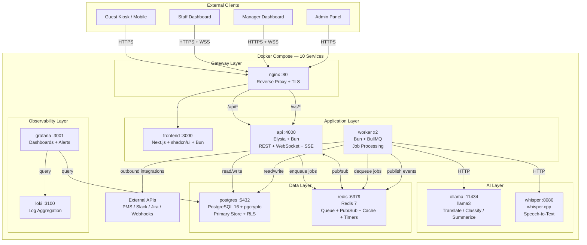

# HospiQ Architecture

## System Overview

HospiQ runs as 10 Docker Compose services organized into five layers: Gateway, Application, AI, Data, and Observability. All services communicate over an internal Docker network, with nginx as the single external entry point.

## Architecture Diagram

## Service Descriptions

### Gateway Layer

**nginx** — Reverse proxy and TLS terminator. Routes `/` to the frontend, `/api/*` to the Elysia API, and `/ws/*` for WebSocket upgrades. Single entry point for all external traffic.

### Application Layer

**frontend** (Next.js + shadcn/ui + Bun) — Server-rendered React application serving five views: Guest Kiosk, Staff Dashboard, Manager Analytics, Manager Escalation, and Admin Settings. Uses D3.js for custom analytics visualizations.

**api** (Elysia + Bun) — REST API, WebSocket server, and SSE endpoint in a single service. Handles authentication (JWT), request ingestion, workflow management, and real-time event broadcasting via Redis pub/sub.

**worker** (Bun + BullMQ) — Background job processors running as 2 replicas. Handles transcription (Whisper), AI classification (Ollama), workflow creation, SLA timer management, escalation checks, and outbound integrations.

### AI Layer

**ollama** (llama3) — Local LLM for translation, urgency classification, department routing, and request summarization. Provides structured JSON output via constrained prompts. No API keys required.

**whisper** (whisper.cpp) — Local speech-to-text engine supporting 99 languages. Receives audio files via HTTP POST, returns transcription with language detection and confidence scores.

### Data Layer

**postgres** (PostgreSQL 16) — Primary data store with Row Level Security for multi-tenant isolation. Uses pgcrypto for encryption of sensitive guest data. Drizzle ORM provides type-safe schema and migrations.

**redis** (Redis 7) — Serves four roles: BullMQ job queue, pub/sub for real-time events, cache for dashboard stats (10s TTL), and delayed job scheduling for SLA timers.

### Observability Layer

**loki** — Log aggregation service. Receives structured JSON logs from all containers via the Docker logging driver. No sidecar required.

**grafana** — Dashboards and alerting. Queries Loki for log analysis and PostgreSQL directly for operational metrics.

## Data Flow

### Guest Request Lifecycle

1. **Input** — Guest submits a voice or text request through the kiosk. The API creates a request record in PostgreSQL and enqueues a transcription job (voice) or classification job (text) to Redis.

2. **Transcription** (voice only) — A worker dequeues the job, sends audio to Whisper.cpp, and stores the transcription. The worker then enqueues a classification job.

3. **AI Classification** — A worker sends the text to Ollama with a structured prompt. Ollama returns: translated text (English), department, urgency level, and a summary. Results are stored in PostgreSQL.

4. **Workflow Creation** — The worker creates a workflow record with an SLA deadline based on urgency and department configuration. A delayed escalation-check job is scheduled in Redis. Real-time events are published via Redis pub/sub.

5. **Staff Assignment** — The API broadcasts the new workflow to connected staff dashboards via WebSocket. Staff claim the workflow, and the guest receives a status update via SSE.

6. **Resolution or Escalation** — Staff resolve the workflow, or the SLA timer fires and the system auto-escalates to management. Each state change creates an audit trail in the workflow_events and audit_log tables.

## Scalability Strategy

**Target:** 1000+ organizations, concurrent real-time connections.

| Layer | Strategy |
|---|---|
| **Frontend** | CDN-deployed Next.js. Static assets cached. Server components reduce client bundle. |
| **API** | Stateless Elysia servers behind nginx. Horizontal scale: add replicas. JWT auth = no session affinity needed (except WebSocket — use Redis-backed sticky sessions). |
| **Workers** | `deploy.replicas: N` in Docker Compose. Each worker processes jobs independently. Scale workers = scale throughput linearly. |
| **Database** | Connection pooling (PgBouncer). Read replicas for analytics queries. Partition `audit_log` and `workflow_events` by `created_at`. Indexes on hot query paths. |
| **Redis** | Single instance handles thousands of orgs. Upgrade path: Redis Cluster for sharding. BullMQ supports multi-node Redis. |
| **AI** | Queue absorbs burst traffic. Multiple Ollama instances behind a load balancer. Swap to cloud API (OpenAI/Anthropic) for production scale. |

## Fault Tolerance

| Failure | Handling |
|---|---|
| **Ollama down** | Circuit breaker opens. Requests flagged "manual_review". Staff classifies manually. System continues operating. |
| **Whisper down** | Circuit breaker. Voice requests queued in DLQ. Text requests unaffected. Retry when service recovers. |
| **Redis down** | API returns errors for new requests. Existing data in Postgres still accessible. Dashboard shows stale state with warning. |
| **Postgres down** | System is unavailable. Redis queue holds pending jobs. On recovery, workers drain the queue. No data loss. |
| **Network drop (guest)** | SSE auto-reconnects. Missed updates stored in `notifications` table. On reconnect, flush pending notifications. Poll endpoint as fallback. |
| **Network drop (staff)** | WebSocket auto-reconnects with Elysia. On reconnect, server sends full current queue state. No missed assignments. |
| **Worker crash** | BullMQ detects stalled job and re-queues automatically. Another worker picks it up. At-least-once processing guaranteed. |
| **Integration target down** | 3 retries with exponential backoff. Failed events logged to `integration_events`. Admin sees failure in integration dashboard. Does not block workflow processing. |
