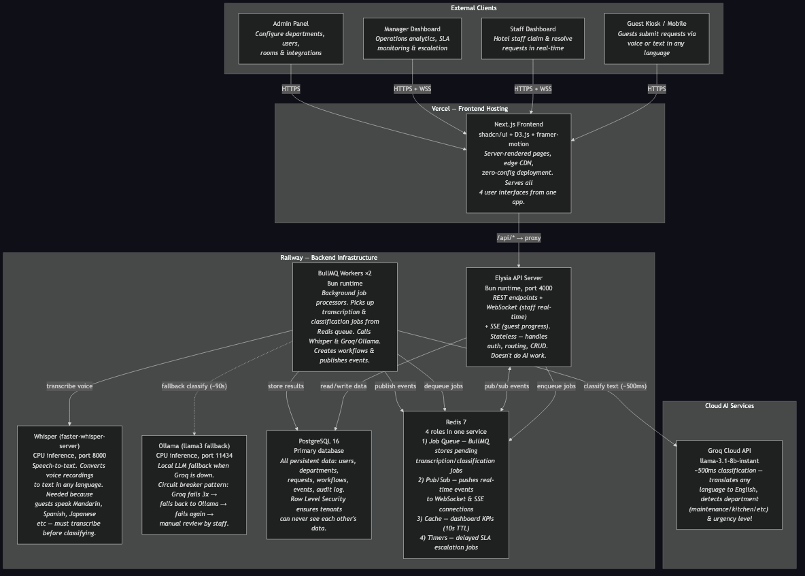

# HospiQ — Architecture Decisions

**Domain:** Hospitality (Hotels & Resorts)
**Challenge:** Real-Time AI-Powered Workflow System

---

## What We Built

A guest at a hotel speaks into a kiosk — in Mandarin, Spanish, or any language. Within seconds, the AI translates their words, understands what they need (maintenance? room service? concierge?), and routes it to the right team. Staff see it appear instantly on their dashboard. The guest watches the progress in real-time on their phone.

**Live demo:** https://hospiq-eight.vercel.app (password: OviieAiDemo2026)

---

## Architecture at a Glance



**Why this shape:**

- **Frontend on Vercel** — Global CDN means the guest kiosk loads fast anywhere in the world. One Next.js app serves all four views (guest, staff, manager, admin).

- **API + Workers on Railway** — The API handles HTTP requests and WebSocket connections. **Workers** are separate background processes that do the heavy lifting — they pick up jobs from a queue (transcribe audio, call the AI, create workflows) so the API stays fast and responsive. Think of it like a restaurant: the API is the host who takes your order, and the workers are the kitchen staff who actually prepare the food. We run **multiple workers** so if one goes down, the others keep processing. Need to handle more volume? Just add more workers — no code changes needed.

- **AI Classification (Groq)** — Currently using Groq's cloud API for fast classification (~500ms). The AI layer is abstracted behind a simple interface — we can swap to our own self-hosted model, OpenAI, Anthropic, or any provider with a one-line configuration change. No vendor lock-in.

- **Whisper for Voice** — Converts speech to text in any language. Runs as its own service so voice processing doesn't slow down text requests.

- **PostgreSQL** — Single source of truth. Row-Level Security ensures Hotel A can never see Hotel B's data, even if there's a bug in the application code.

- **Redis** — Does four jobs in one: message queue (BullMQ), real-time event broadcasting (pub/sub), dashboard caching, and SLA countdown timers.

---

## Key Decisions

| Decision | What We Chose | Why |
|----------|--------------|-----|
| **AI Provider** | Groq cloud (swappable) | ~500ms classification; can switch to self-hosted or any OpenAI-compatible API |
| **Real-time** | WebSocket + SSE | Staff get two-way live updates; guests receive progress via lightweight SSE |
| **Queue system** | Redis + BullMQ | One service handles queue, cache, pub/sub, and SLA timers |
| **Database** | PostgreSQL + RLS | Multi-tenant isolation enforced at the database level, not application code |
| **Voice** | Whisper (faster-whisper) | Local speech-to-text, no external API keys, supports 90+ languages |
| **Frontend** | Next.js + shadcn/ui + D3.js | Server-rendered pages, accessible components, custom analytics charts |
| **Workers** | Multiple replicas | Background processors for AI tasks — scale by adding more |
| **Deployment** | Vercel + Railway | Frontend on edge CDN, backend on managed containers |

---

## Redundancy — Nothing Has a Single Point of Failure

```
AI CLASSIFICATION — 3-tier fallback:

  ┌─────────────┐     ┌──────────────┐     ┌─────────────────┐
  │  Groq Cloud  │────▶│  Self-hosted  │────▶│  Manual Review   │
  │  (~500ms)    │     │  Ollama      │     │  (staff assigns) │
  │  PRIMARY     │     │  FALLBACK    │     │  LAST RESORT     │
  └─────────────┘     └──────────────┘     └─────────────────┘

  Circuit breaker: 3 failures opens the circuit → fallback activates
                   30 seconds later → retries the primary
```

| What Fails | What Happens | Recovery |
|------------|-------------|----------|
| **AI provider down** | Circuit breaker activates → falls back to self-hosted model → then manual review | Automatic, zero downtime |
| **Worker crashes** | BullMQ detects stalled job → re-queues to another worker | Automatic, ~5 seconds |
| **Redis down** | API serves from PostgreSQL, queue holds in memory | Dashboard stale but functional |
| **WebSocket drops** | Auto-reconnects with exponential backoff | Transparent to user |
| **Database down** | Redis holds queued jobs → workers drain on recovery | No data loss |

---

## Scalability — Built to Grow

| Layer | How It Scales |
|-------|--------------|
| **Frontend** | Vercel edge CDN — already global, zero config |
| **API** | Stateless — add replicas behind a load balancer |
| **Workers** | Each worker processes jobs independently. 2 workers = 2x throughput. 10 workers = 10x. Just change a number in the config. |
| **AI** | Swap provider or add multiple endpoints. The abstraction layer makes this trivial. |
| **Database** | Connection pooling, read replicas for analytics, table partitioning for audit logs |
| **Redis** | Single instance handles thousands of orgs. Upgrade path: Redis Cluster for sharding |

The architecture separates concerns so each layer scales independently. The most common bottleneck — AI classification — scales by adding more workers. During peak check-in hours, spin up 10 workers. At 2 AM, scale back to 2. The queue absorbs the burst and workers drain it at their own pace.

---

## What Makes It Work

1. **Any language in, English out** — AI translates and classifies in one step
2. **True real-time** — WebSocket push, not polling. Staff see cards appear live.
3. **No single point of failure** — Every critical path has a fallback
4. **AI provider is swappable** — Groq today, your own model tomorrow. One config change.
5. **Multi-tenant by default** — Database-level isolation, not application-level filtering
6. **Scales horizontally** — More workers = more throughput. No architecture changes needed.
