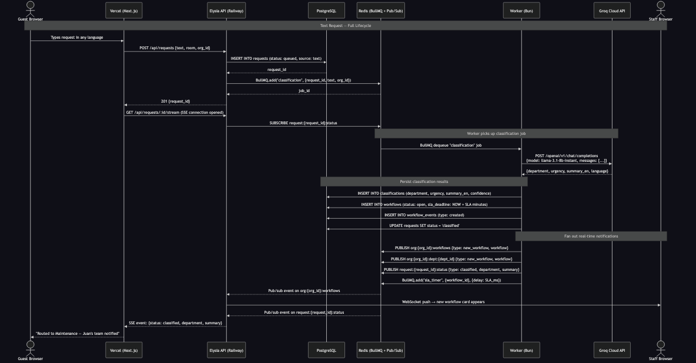
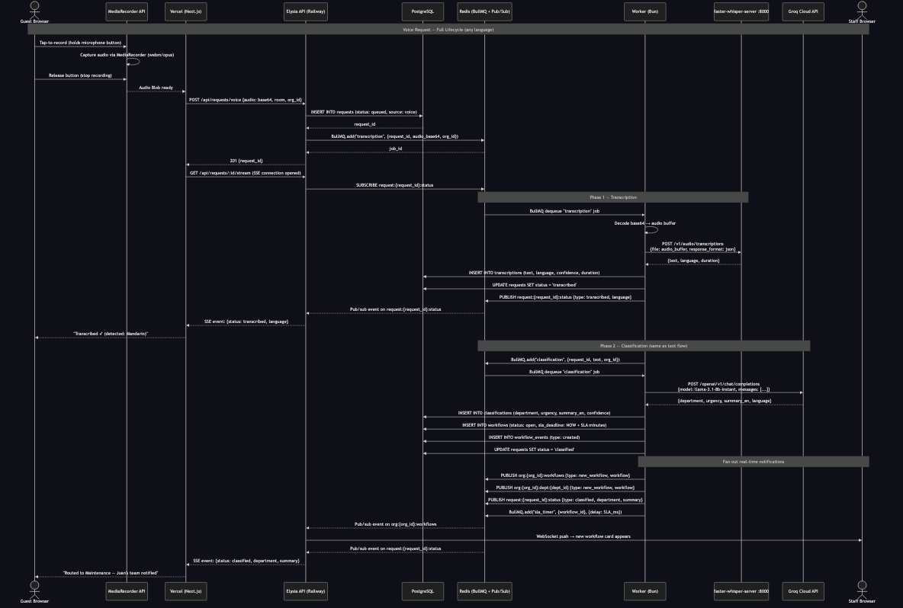
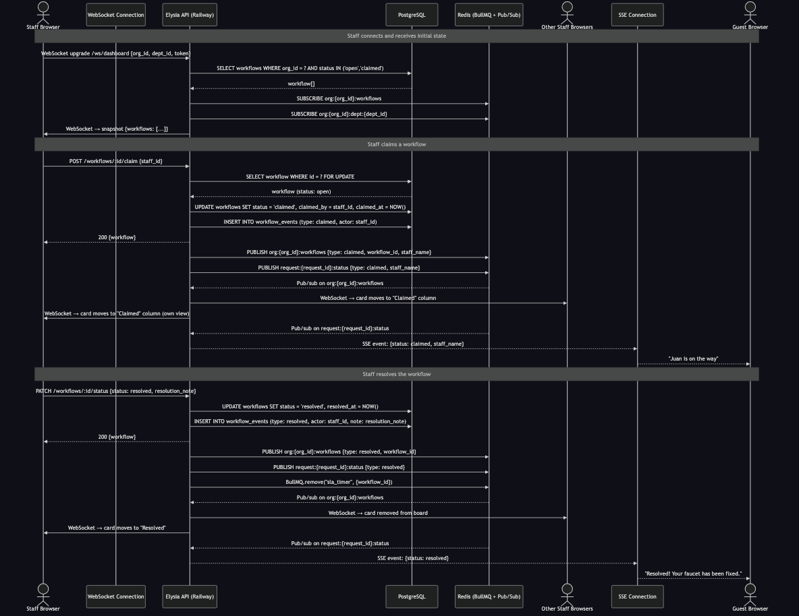
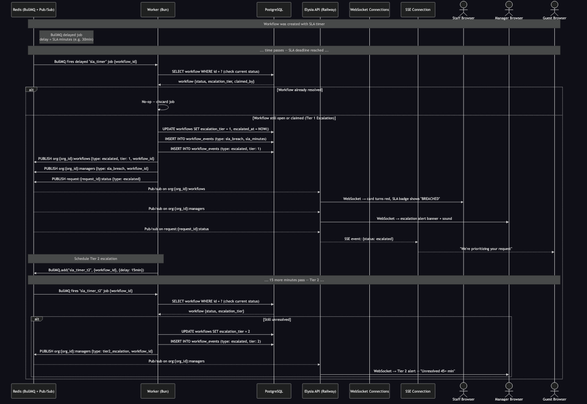
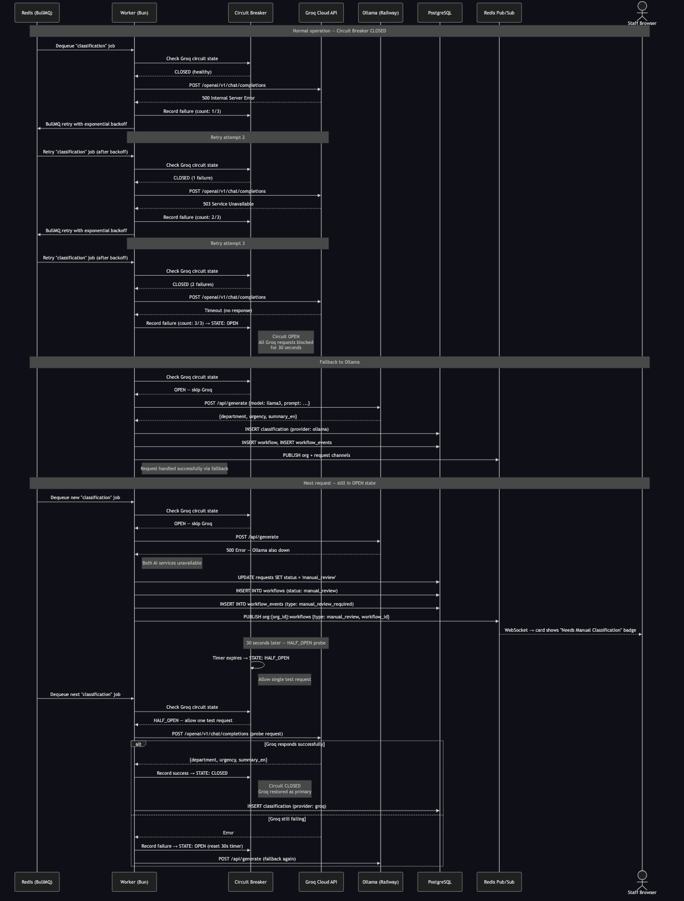
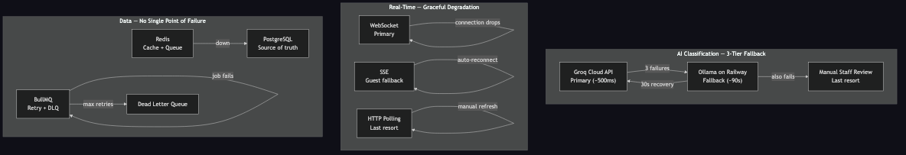
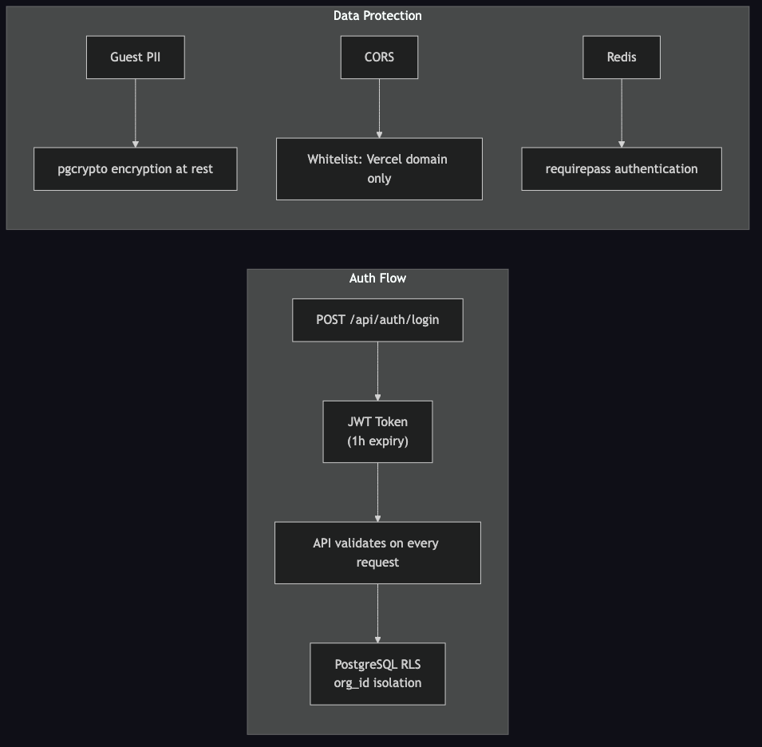
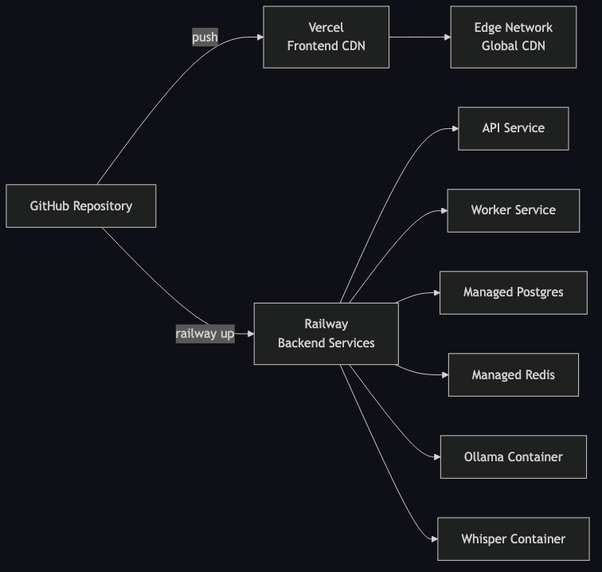

# HospiQ -- Technical Architecture Document

## Table of Contents

1. [Executive Summary](#1-executive-summary)
2. [System Architecture](#2-system-architecture)
3. [Technology Stack](#3-technology-stack)
4. [Data Flow Diagrams](#4-data-flow-diagrams)
5. [Redundancy & Fault Tolerance](#5-redundancy--fault-tolerance)
6. [Security Architecture](#6-security-architecture)
7. [Scalability Strategy](#7-scalability-strategy)
8. [Testing Strategy](#8-testing-strategy)
9. [Deployment Architecture](#9-deployment-architecture)
10. [API Reference](#10-api-reference)

---

## 1. Executive Summary

HospiQ is a real-time AI-powered hospitality workflow system that transforms how hotels handle guest requests. When a guest submits a request -- whether typed in Mandarin, spoken in Spanish, or written in Japanese -- HospiQ automatically transcribes, translates, classifies, and routes the request to the correct hotel department within seconds. Staff see new tasks appear on a live Kanban dashboard, claim them with a click, and guests receive real-time progress updates on their device. If a request breaches its SLA deadline, the system automatically escalates to management.

The core problem HospiQ solves is the gap between guest expectations for instant service and the operational reality of multilingual communication, manual dispatch, and invisible request status. Traditional hotel operations rely on phone calls, radio dispatch, and paper logs -- none of which provide the transparency or speed that modern guests expect. HospiQ replaces this with an AI-first pipeline where every request is tracked, timed, and visible to all stakeholders in real time.

The architecture follows a clear separation of concerns: a Next.js frontend on Vercel serves four user interfaces (guest kiosk, staff dashboard, manager analytics, admin panel), while an Elysia API on Railway handles REST endpoints, WebSocket connections for staff, and SSE streams for guests. Background workers process AI classification through Groq Cloud (primary, ~500ms) with Ollama as a circuit-breaker fallback. PostgreSQL stores all persistent state with Row Level Security for multi-tenant isolation, and Redis serves as the unified backbone for job queues, pub/sub events, caching, and SLA timers.

---

## 2. System Architecture

The following diagram shows the complete system topology, from external clients through the frontend CDN, API layer, background workers, AI services, and data stores.

### Service Layer Responsibilities

| Layer | Service | Role |
|-------|---------|------|
| **Gateway** | Vercel Edge CDN | Serves the Next.js frontend globally with low latency. Routes `/api/*` requests to the Railway-hosted API. |
| **Application** | Elysia API (port 4000) | Stateless REST API server. Handles authentication (JWT), request ingestion, workflow CRUD, WebSocket connections for staff dashboards, and SSE streams for guest progress. Does not perform AI work -- delegates to workers via Redis queue. |
| **Application** | BullMQ Workers (x2) | Background job processors running on Bun. Dequeue transcription and classification jobs from Redis, call Whisper and Groq/Ollama, persist results to PostgreSQL, and fan out real-time events via Redis pub/sub. |
| **AI** | Groq Cloud API | Primary AI classification endpoint. Receives guest text (any language), returns structured JSON with department, urgency, English summary, and detected language in ~500ms. |
| **AI** | Ollama (port 11434) | Circuit-breaker fallback for AI classification. Runs llama3 on Railway CPU. Slower (~90s) but ensures the system never stops functioning when Groq is unavailable. |
| **AI** | Whisper (port 8000) | Speech-to-text engine. Converts voice recordings in 99+ languages to text with language detection and confidence scores. |
| **Data** | PostgreSQL 16 | Source of truth for all persistent state. Row Level Security enforces multi-tenant data isolation. pgcrypto encrypts sensitive guest data at rest. |
| **Data** | Redis 7 | Unified infrastructure layer: BullMQ job queue, pub/sub for real-time events, cache for dashboard KPIs (10s TTL), and delayed job scheduling for SLA timers. |

---

## 3. Technology Stack

### Frontend Layer

#### Next.js

- **What it does in HospiQ:** Renders the five views -- guest kiosk, staff dashboard, manager analytics, manager escalation, and admin panel -- with server components for fast initial loads and client components for real-time interactivity (SSE streams, WebSocket connections, D3 charts). Deployed on Vercel at `https://hospiq-eight.vercel.app`.
- **Why chosen:** File-based routing maps naturally to the multi-page structure. Server components reduce the client JavaScript bundle for pages that do not need interactivity. Vercel provides zero-config deployment with edge CDN.
- **Trade-offs:** Heavier than Vite + React for a purely client-side app. Justified by the 5-view structure and future SSR potential for the kiosk (SEO, shared link previews).
- **Connects to:** Vercel (deployment), Elysia API (REST/SSE/WebSocket proxy), shadcn/ui (component library), D3.js (analytics charts).

#### shadcn/ui

- **What it does in HospiQ:** Provides the accessible, customizable component library for all UI surfaces -- cards, buttons, dialogs, tables, tabs, navigation. Components are copied into the project (not imported from `node_modules`), enabling deep customization.
- **Why chosen:** Lightweight, accessible, and does not impose a heavy design system. Components integrate cleanly with the custom D3 visualizations that require precise layout control.
- **Trade-offs:** More setup than a batteries-included library like MUI. Justified by the need for custom styling and seamless D3 integration.
- **Connects to:** Next.js (rendering), Tailwind CSS (styling), D3.js (chart containers).

#### D3.js

- **What it does in HospiQ:** Powers the manager analytics command center with interactive visualizations -- request volume heatmaps, department load bar charts, SLA compliance trend lines, and response time distributions. Rendered client-side with live data from the analytics API.
- **Why chosen:** Full control over custom visualizations that match the HospiQ design system. No opinionated chart library constraining the analytics views.
- **Trade-offs:** Higher implementation effort than Chart.js or Recharts. Justified by the need for highly custom, interactive analytics that go beyond standard chart types.
- **Connects to:** Next.js (React refs for DOM access), Analytics API (data source), shadcn/ui (layout containers).

#### framer-motion

- **What it does in HospiQ:** Animates workflow card transitions on the staff Kanban board (card appears, moves between columns, fades on resolve), guest progress stepper updates, and page transitions. Provides `prefers-reduced-motion` support.
- **Why chosen:** Declarative animation API that integrates naturally with React component lifecycle. Layout animations handle the Kanban column transitions that CSS alone cannot.
- **Trade-offs:** Adds ~30KB to the client bundle. Justified by the real-time nature of the UI where visual continuity matters for understanding state changes.
- **Connects to:** Next.js (React components), shadcn/ui (animated wrappers), WebSocket/SSE (triggers animations on real-time events).

### API Layer

#### Elysia on Bun

- **What it does in HospiQ:** Serves the REST API (request submission, workflow CRUD, org management), maintains WebSocket connections for staff dashboards, and streams SSE events to guest browsers -- all from a single server running on Railway at port 4000.
- **Why chosen:** Native WebSocket support eliminates the need for a separate WS service. End-to-end type safety with Drizzle ORM. Bun's runtime performance is measurably faster than Node.js for HTTP handling -- matters at 1000+ orgs scale.
- **Trade-offs:** Smaller ecosystem than Express. Mitigated by the focused scope of the API surface (30 endpoints).
- **Connects to:** PostgreSQL (via Drizzle ORM), Redis (pub/sub, queue enqueue), Bun (runtime), Next.js frontend (serves API requests).

#### Bun Runtime

- **What it does in HospiQ:** Runs both the Elysia API server and BullMQ workers. Provides the test runner for 98 unit tests. Handles password hashing via `Bun.password`.
- **Why chosen:** Faster cold starts and HTTP throughput than Node.js. Built-in test runner with Jest-compatible syntax eliminates the need for a separate test framework. Native TypeScript execution without a build step.
- **Trade-offs:** Less mature than Node.js. Some npm packages may have compatibility issues. Mitigated by the focused dependency tree and thorough testing.
- **Connects to:** Elysia (API framework), BullMQ (worker runtime), Drizzle (ORM), unit tests.

#### WebSocket (Staff)

- **What it does in HospiQ:** Delivers live workflow updates to staff dashboards -- new cards appearing, cards moving between columns (claimed, in-progress, resolved), escalation alerts. Accepts heartbeat pings. Each connection subscribes to the org-level and department-level Redis pub/sub channels.
- **Why chosen:** Staff dashboards need low-latency bidirectional communication. Updates must appear within seconds of a state change.
- **Trade-offs:** Requires sticky sessions or Redis-backed state for horizontal scaling. Currently handled by per-connection Redis subscribers.
- **Connects to:** Elysia (WebSocket handler), Redis pub/sub (event source), PostgreSQL (initial snapshot query).

#### SSE (Guests)

- **What it does in HospiQ:** Pushes status progress updates to individual guest sessions -- "transcribed," "classified," "claimed by Juan," "resolved." Auto-reconnects on connection drop. Heartbeat every 15 seconds.
- **Why chosen:** Guests only need to receive updates (unidirectional). SSE is simpler than WebSocket, auto-reconnects natively, and works through more proxies and firewalls.
- **Trade-offs:** Cannot send data from client to server (not needed for guests). Two real-time mechanisms to maintain (WebSocket + SSE). Justified by fundamentally different interaction patterns.
- **Connects to:** Elysia (SSE endpoint), Redis pub/sub (per-request channel), Next.js (EventSource client).

### AI Layer

#### Groq Cloud API (Primary)

- **What it does in HospiQ:** Receives guest request text (any language) and returns a structured classification: department, urgency level, English summary, and detected language. Runs `llama-3.1-8b-instant` via Groq's OpenAI-compatible endpoint. Classification completes in ~500ms.
- **Why chosen:** Near-instant classification makes the guest experience feel responsive. OpenAI-compatible API means swapping providers is trivial (change one URL).
- **Trade-offs:** External dependency; sends request text to a third-party API. Mitigated by: Ollama fallback ensures the system never stops, and for privacy-sensitive deployments Ollama can be set as primary.
- **Connects to:** BullMQ Workers (called during classification job), Circuit Breaker (monitors failures), Ollama (fallback).

#### Ollama on Railway (Fallback)

- **What it does in HospiQ:** Serves as the circuit-breaker fallback when Groq is unavailable. Runs llama3 on Railway CPU. Also serves as the default AI provider for local development and air-gapped environments.
- **Why chosen:** Ensures the system never loses classification capability. The circuit breaker uses a tiered fallback: Groq -> Ollama -> manual_review. If Groq fails 3 consecutive times, the circuit opens and routes to Ollama. If Ollama also fails, requests are flagged for manual staff review.
- **Trade-offs:** CPU-only inference is ~90 seconds per classification vs. Groq's ~500ms. Acceptable as a degraded-mode fallback.
- **Connects to:** Circuit Breaker (activated on Groq failure), BullMQ Workers (called as fallback), Railway (container hosting).

#### Faster Whisper (Speech-to-Text)

- **What it does in HospiQ:** Transcribes guest voice recordings (any language) into text and detects the spoken language. Runs as `fedirz/faster-whisper-server:latest-cpu` on port 8000. Receives audio as base64 through the BullMQ job queue.
- **Why chosen:** Supports 99+ languages. Runs alongside other backend services on Railway. Voice audio passed as base64 through BullMQ avoids shared volume mounts between containers.
- **Trade-offs:** Base64 encoding increases payload size by ~33%. Acceptable because voice clips are short (typically <30 seconds).
- **Connects to:** BullMQ Workers (receives audio via job queue), PostgreSQL (stores transcription results), Redis pub/sub (publishes "transcribed" status).

### Data Layer

#### PostgreSQL 16 + Drizzle ORM

- **What it does in HospiQ:** Stores all persistent state -- organizations, users, guest requests, transcriptions, AI classifications, workflows, workflow events, SLA configurations, audit log, integrations, and field mappings (14 tables total). Row Level Security enforces multi-tenant isolation. pgcrypto provides encryption at rest for guest PII.
- **Why chosen:** Relational data model fits naturally (workflows to events, requests to classifications). RLS enforces isolation at the database level -- a single misconfigured query cannot leak data across organizations. Drizzle ORM provides type-safe queries with zero runtime overhead.
- **Trade-offs:** Aggregate analytics queries on large datasets may slow down. Mitigated by Redis caching (10s TTL on dashboard stats) and potential read replicas.
- **Connects to:** Elysia API (read/write via Drizzle), BullMQ Workers (store classification/transcription results), Redis (cache invalidation).

#### Redis 7 + BullMQ

- **What it does in HospiQ:** Serves four roles from a single instance: (1) BullMQ job queue for transcription, classification, and integration jobs with retries and backoff; (2) pub/sub channels for broadcasting real-time events to WebSocket/SSE handlers; (3) cache layer for dashboard aggregate stats with 10s TTL; (4) delayed jobs for SLA countdown timers that fire escalation workflows.
- **Why chosen:** Single Redis instance serves four concerns -- operational simplicity. BullMQ provides reliable job processing with retries, exponential backoff, delayed jobs, and dead letter queues out of the box.
- **Trade-offs:** Redis is single-threaded. At extreme scale, Kafka would provide better throughput and durability. For 1000+ orgs with moderate request volume, Redis handles this comfortably. Horizontal scaling path: Redis Cluster.
- **Connects to:** Elysia API (pub/sub subscriber, cache reads), BullMQ Workers (job consumer/producer), SLA timers (delayed job scheduling).

### Infrastructure

#### Vercel (Frontend Hosting)

- **What it does in HospiQ:** Hosts the Next.js frontend at `https://hospiq-eight.vercel.app`. Serves via edge CDN with automatic preview deployments on every pull request.
- **Why chosen:** Zero-config Next.js deployment. Edge CDN provides global low-latency access. Automatic preview deployments enable PR-based review of UI changes.
- **Trade-offs:** Split deployment (Vercel + Railway) adds operational complexity vs. a single Docker Compose. Justified by Vercel's CDN giving global latency benefits for the frontend.
- **Connects to:** Next.js (deployed framework), Railway API (proxied `/api/*` requests).

#### Railway (Backend Hosting)

- **What it does in HospiQ:** Runs the five backend services as managed Docker containers -- Elysia API, BullMQ Worker (x2 replicas), Ollama, faster-whisper-server -- plus managed PostgreSQL and Redis instances. Provides environment variable management and zero-downtime deploys.
- **Why chosen:** Managed Docker containers with built-in Postgres and Redis provisioning. Each service scales independently.
- **Trade-offs:** Vendor lock-in to Railway's container platform. Mitigated by standard Docker images that can deploy anywhere, and Docker Compose for local/self-hosted environments.
- **Connects to:** All backend services, PostgreSQL (managed), Redis (managed).

#### Docker Compose (Local Development)

- **What it does in HospiQ:** Brings up the full stack locally as 10 services: frontend, API, worker, PostgreSQL, Redis, Ollama, Whisper, nginx (reverse proxy), Grafana, and Loki. Ollama serves as the default AI provider in local mode (no Groq API key required).
- **Why chosen:** One-command local development with full parity to production. Developers can work offline or in air-gapped environments.
- **Trade-offs:** Requires Docker and significant local resources (especially for Ollama). Mitigated by the ability to selectively start services.
- **Connects to:** All services (local orchestration).

#### nginx (Local Dev Only)

- **What it does in HospiQ:** Reverse proxy and TLS terminator for local development. Routes `/` to the frontend, `/api/*` to the Elysia API, and `/ws/*` for WebSocket upgrades. In production, Vercel and Railway handle routing natively.
- **Why chosen:** Provides a single entry point that mirrors the production routing behavior during local development.
- **Trade-offs:** Only used locally. Production relies on platform-native routing.
- **Connects to:** Frontend (proxied), API (proxied), WebSocket (upgrade handling).

#### Grafana + Loki (Observability)

- **What it does in HospiQ:** Loki collects structured JSON logs from all backend containers via the Docker logging driver. Grafana visualizes logs alongside direct PostgreSQL queries for operational metrics like SLA breach rates and classification latency.
- **Why chosen:** Lightweight alternative to ELK stack (2 containers vs. 3, fraction of the RAM). Docker logging driver sends logs to Loki without a sidecar.
- **Trade-offs:** Less powerful full-text search than Elasticsearch. Sufficient for structured JSON log querying.
- **Connects to:** All backend services (log collection), PostgreSQL (metrics queries).

---

## 4. Data Flow Diagrams

### 4.1 Text Request Flow

A guest types a request in any language. The API stores the request, enqueues a classification job, and the worker calls Groq to translate, classify, and route it. The guest receives real-time progress via SSE; staff see a new card appear on the Kanban board via WebSocket.

### 4.2 Voice Request Flow

A guest records a voice message in any language. The flow adds a transcription phase (via Whisper) before classification. The guest sees two progress steps: "transcribed" then "classified."

### 4.3 Staff Claim & Resolve Flow

Staff connect via WebSocket and receive a snapshot of active workflows. When a staff member claims a workflow, other staff see the card move in real-time, and the guest receives a progress update via SSE.

### 4.4 SLA Escalation Flow

When a workflow is created, a delayed BullMQ job is scheduled at the SLA deadline. If the workflow is still unresolved when the timer fires, the system escalates to Tier 1 (staff alert + manager notification). A second timer fires 15 minutes later for Tier 2 escalation.

### 4.5 Circuit Breaker Flow

The circuit breaker protects against cascading failures when the primary AI service (Groq) is unavailable. After 3 consecutive failures, the circuit opens and all requests route to Ollama. After 30 seconds, a single probe request tests if Groq has recovered.

---

## 5. Redundancy & Fault Tolerance

HospiQ is designed with no single point of failure for user-facing functionality. Every external dependency has a fallback path, and every background job has retry semantics.

### Fault Tolerance Matrix

| Failure | Impact | Recovery |
|---------|--------|----------|
| Groq API down | Classification slows to ~90s | Circuit breaker opens after 3 failures, routes to Ollama fallback |
| Ollama down | No AI classification available | Circuit breaker routes to manual_review; staff classifies manually |
| Whisper down | Voice requests fail | Text requests unaffected; voice jobs queued in DLQ, retried on recovery |
| Redis down | No real-time updates, no queue | API serves from PostgreSQL directly; dashboard shows stale state with warning |
| PostgreSQL down | System unavailable | Redis holds queued jobs; on recovery workers drain the queue; no data loss |
| WebSocket drops | Staff loses live updates | Auto-reconnect with exponential backoff; server sends full snapshot on reconnect |
| SSE drops | Guest loses progress updates | Auto-reconnect native to EventSource; poll fallback endpoint as last resort |
| Worker crash | Jobs stall | BullMQ detects stalled job, re-queues automatically; another worker picks it up |
| Integration target down | External notifications fail | 3 retries with exponential backoff; failed events logged; does not block workflow |
| Network drop (guest) | Cannot submit or receive updates | Missed updates stored; on reconnect, pending notifications flushed |

---

## 6. Security Architecture

### JWT Authentication

All authenticated API requests require a JWT token in the `Authorization` header. The token is issued by `POST /api/auth/login` after validating email/password credentials (password hashed via `Bun.password` using bcrypt). The JWT payload contains:

- `sub` -- User ID
- `orgId` -- Organization ID (used for RLS enforcement)
- `role` -- User role (staff, manager, admin)
- `departmentId` -- Optional department scope

Tokens expire after 1 hour. WebSocket connections pass the token as a query parameter during the upgrade handshake. The API validates the token on every request via middleware (`authMiddleware` for guest-accessible routes, `requireAuth` for staff routes, `requireRole` for admin/manager routes).

### Row Level Security (Multi-Tenancy)

PostgreSQL Row Level Security policies ensure that every query is automatically filtered by `org_id`. Even if application code contains a bug that omits an organization filter, the database layer prevents cross-tenant data access. This is the primary defense against data leakage in a multi-tenant SaaS system.

### CORS Configuration

The API server is configured with a strict CORS policy that only allows requests from the Vercel-hosted frontend domain. This prevents unauthorized third-party websites from making API calls with stolen tokens.

### Redis Authentication

The Redis instance requires password authentication (`requirepass`). Connection strings include the password in the URL. In production on Railway, credentials are managed via environment variables and are never committed to source control.

### Encryption at Rest

Guest personally identifiable information (PII) -- such as original request text that may contain names, room numbers, or personal details -- is encrypted at rest using PostgreSQL's `pgcrypto` extension. This ensures that a database backup or snapshot does not expose raw guest data.

---

## 7. Scalability Strategy

**Target:** 1000+ organizations with concurrent real-time connections.

| Layer | Current State | Scaling Strategy |
|-------|--------------|-----------------|
| **Frontend** | CDN-deployed Next.js on Vercel | Static assets cached at edge. Server components reduce client bundle. Global CDN handles geographic distribution automatically. |
| **API** | Single Elysia server on Railway | Stateless design enables horizontal scaling by adding replicas. JWT auth eliminates session affinity (except WebSocket -- use Redis-backed sticky sessions). |
| **Workers** | 2 BullMQ worker replicas | `deploy.replicas: N` in Docker Compose or Railway. Each worker processes jobs independently. Scale workers = scale throughput linearly. |
| **Database** | Single PostgreSQL 16 instance | Connection pooling via PgBouncer. Read replicas for analytics queries. Partition `audit_log` and `workflow_events` by `created_at`. Indexes on hot query paths. |
| **Redis** | Single Redis 7 instance | Handles thousands of orgs comfortably at moderate request volume. Upgrade path: Redis Cluster for sharding. BullMQ supports multi-node Redis natively. |
| **AI (Primary)** | Groq Cloud API | Cloud-hosted, scales independently. Queue absorbs burst traffic. No infrastructure to manage. |
| **AI (Fallback)** | Ollama on Railway (CPU) | Only used when Groq is down. Can be scaled to GPU instances for faster fallback if needed. |
| **Whisper** | Single CPU instance on Railway | Voice requests are queued; throughput limited by CPU inference speed. Scale by adding replicas or upgrading to GPU instances. |

### Bottleneck Analysis

1. **WebSocket connections** -- Each Elysia instance can handle ~10K concurrent WebSocket connections. At 1000 orgs with ~10 staff each, this is 10K connections on a single instance. Beyond this, horizontal scaling with Redis pub/sub fan-out.
2. **AI classification throughput** -- Groq handles burst traffic well. BullMQ queue absorbs spikes. At sustained high volume, Groq's rate limits become the bottleneck; mitigated by queue backpressure.
3. **PostgreSQL write throughput** -- Each request creates 4-5 rows (request, classification, workflow, events). At 1000 requests/minute, this is ~5000 writes/minute -- well within PostgreSQL's capacity.

---

## 8. Testing Strategy

### 8.1 Unit Tests (98 tests, Bun test runner)

Tests run in ~370ms with zero external dependencies (no Docker, no databases, no network calls).

| Package | Tests | Coverage Area |
|---------|-------|---------------|
| **API** | 7 | JWT sign/verify/tamper detection |
| **API** | 9 | Circuit breaker state machine (CLOSED, OPEN, HALF_OPEN transitions) with in-memory Redis mock |
| **API** | 21 | Field mapping transforms: dot-notation resolution, uppercase, truncate, prefix, map, iso639 |
| **Worker** | 10 | Classification prompt structure and content verification |
| **Worker** | 14 | Fuzzy department matching across 5 strategies: exact name, slug, slug-contains, name-contains, first-word |
| **DB** | 28 | Schema export verification for all 14 tables, 9 enum types, and relation definitions |
| **DB** | 9 | Seed ID determinism, UUID format, and uniqueness across all entity sets |

**Run:** `bun test apps/api/src/__tests__ apps/worker/src/__tests__ packages/db/src/__tests__`

### 8.2 E2E Tests (18 tests, Playwright)

End-to-end tests run against the full stack (~2 minutes). Custom test fixtures provide pre-authenticated pages per role with retry logic for API availability.

| Suite | Tests | Description |
|-------|-------|-------------|
| **Guest flow** | 3 | Submit text request, room pre-fill via URL param, graceful error on network failure |
| **Staff flow** | 3 | View kanban dashboard, claim a workflow, filter by department |
| **Real-time sync** | 1 | Two browser contexts: guest submits request, staff dashboard receives it via WebSocket within 15 seconds |
| **Escalation** | 2 | Manager sees escalated workflows, override AI classification |
| **Fault tolerance** | 1 | System handles AI service unavailability gracefully |
| **Analytics** | 3 | KPI cards render, D3 SVG charts present, system health indicators |
| **Admin** | 3 | View departments, audit log, rooms |
| **Demo simulation** | 2 | Role selection buttons, guest navigation |

**Run locally:** `cd apps/frontend && npx playwright test`

### 8.3 Demo Recordings (5 clips, Playwright + ffmpeg)

Side-by-side video clips recorded via Playwright's video capture against the live production deployment, stitched with ffmpeg. Each clip includes on-screen text overlay banners injected via `page.evaluate()`.

| Clip | Left Panel | Right Panel |
|------|-----------|-------------|
| 1. Multi-language AI | Guest submits in Mandarin | Staff sees translated English card |
| 2. Real-time WebSocket | Guest submits request | Staff dashboard updates live |
| 3. Staff claim & resolve | Staff claims and resolves | Guest stepper updates in parallel |
| 4. Manager analytics | D3 charts and KPIs | SLA breach monitoring |
| 5. Demo landing + admin | Role selection page | Department configuration |

**Generate:** `npx playwright test e2e/record-feature-clips.spec.ts --workers=1`

---

## 9. Deployment Architecture

### Production URLs

| Component | Platform | URL / Details |
|-----------|----------|---------------|
| Frontend | Vercel | `https://hospiq-eight.vercel.app` -- Edge CDN, automatic preview deploys |
| API | Railway | `https://hospiq-api-production.up.railway.app` -- Elysia + Bun, port 4000 |
| Worker | Railway | Bun + BullMQ, 2 replicas |
| PostgreSQL | Railway | Managed PostgreSQL 16 |
| Redis | Railway | Managed Redis 7 |
| Ollama | Railway | `ollama/ollama`, port 11434 (fallback AI) |
| Whisper | Railway | `fedirz/faster-whisper-server:latest-cpu`, port 8000 |
| AI Classification | Groq Cloud | `https://api.groq.com/openai/v1/chat/completions` (`llama-3.1-8b-instant`) |
| GitHub | -- | `https://github.com/tachyon-development/test-translation` |

### Local Development

Docker Compose brings up the full stack locally as 10 services including nginx (reverse proxy), Grafana, and Loki for observability. Ollama serves as the primary AI provider in local mode (no Groq API key required).

---

## 10. API Reference

All endpoints are served from the Elysia API at port 4000. Authentication is via JWT token in the `Authorization` header unless noted otherwise.

### Authentication

| Method | Endpoint | Auth | Description |
|--------|----------|------|-------------|
| `POST` | `/api/auth/login` | None | Authenticate with email/password, returns JWT token and user object |

### Guest Requests

| Method | Endpoint | Auth | Description |
|--------|----------|------|-------------|
| `POST` | `/api/requests` | Middleware | Submit a text request `{text, room_number, org_id, lang?}` |
| `POST` | `/api/requests/voice` | Middleware | Submit a voice request `{audio: File, room_number, org_id}` |
| `GET` | `/api/requests/:id/status` | Middleware | Poll request status (fallback for SSE) |
| `GET` | `/api/requests/:id/stream` | None | SSE stream for real-time guest progress updates |

### Workflows

| Method | Endpoint | Auth | Description |
|--------|----------|------|-------------|
| `GET` | `/api/workflows` | Staff+ | List workflows with optional filters: `department_id`, `status`, `priority` |
| `GET` | `/api/workflows/:id` | Staff+ | Workflow detail with AI classification and event timeline |
| `POST` | `/api/workflows/:id/claim` | Staff+ | Claim a pending workflow |
| `PATCH` | `/api/workflows/:id/status` | Staff+ | Update status to `in_progress` or `resolved` with optional `resolution_note` |
| `POST` | `/api/workflows/:id/escalate` | Staff+ | Manually escalate a workflow to management |
| `POST` | `/api/workflows/:id/comment` | Staff+ | Add a comment/note to the workflow timeline |
| `PATCH` | `/api/workflows/:id/classify` | Staff+ | Manager override: reassign department and priority |

### Analytics

| Method | Endpoint | Auth | Description |
|--------|----------|------|-------------|
| `GET` | `/api/analytics/overview` | Manager/Admin | KPI overview: active count, avg response time, resolution rate, SLA miss rate (cached 10s) |
| `GET` | `/api/analytics/departments` | Manager/Admin | Per-department breakdown: active, resolved, avg response time, SLA compliance |
| `GET` | `/api/analytics/ai` | Manager/Admin | AI performance: confidence distribution, urgency counts, total classifications |

### Organization Administration

| Method | Endpoint | Auth | Description |
|--------|----------|------|-------------|
| `GET` | `/api/org/departments` | Admin | List departments for the organization |
| `POST` | `/api/org/departments` | Admin | Create department with SLA config and escalation contact |
| `PATCH` | `/api/org/departments/:id` | Admin | Update department name, SLA config, or escalation contact |
| `GET` | `/api/org/rooms` | Admin | List rooms for the organization |
| `POST` | `/api/org/rooms` | Admin | Create room `{number, floor, zone?}` |
| `GET` | `/api/org/users` | Admin | List users for the organization |
| `POST` | `/api/org/users` | Admin | Create user `{name, email, role, department_id?, password}` |
| `GET` | `/api/org/audit-log` | Admin | Paginated audit trail with actor details |

### Integrations

| Method | Endpoint | Auth | Description |
|--------|----------|------|-------------|
| `GET` | `/api/integrations/providers` | Admin | List available integration adapters (webhook, Slack, Jira, PMS) |
| `GET` | `/api/integrations` | Admin | List configured integrations (paginated) |
| `POST` | `/api/integrations` | Admin | Create integration `{name, type, provider?, config, auth?, trigger_on?, filter_departments?}` |
| `GET` | `/api/integrations/:id` | Admin | Integration detail with full config |
| `PATCH` | `/api/integrations/:id` | Admin | Update integration config, auth, or trigger settings |
| `DELETE` | `/api/integrations/:id` | Admin | Remove integration and related mappings/events |
| `POST` | `/api/integrations/:id/test` | Admin | Send test payload and return request/response with latency |
| `PATCH` | `/api/integrations/:id/toggle` | Admin | Enable or disable integration |
| `GET` | `/api/integrations/:id/events` | Admin | Paginated event log for integration (success/failure history) |
| `GET` | `/api/integrations/:id/mappings` | Admin | List field mappings for integration |
| `PUT` | `/api/integrations/:id/mappings` | Admin | Replace all field mappings `{mappings: [{source_field, target_field, transform?}]}` |

### Health

| Method | Endpoint | Auth | Description |
|--------|----------|------|-------------|
| `GET` | `/api/health/services` | None | Health check for all services: postgres, redis, ollama, whisper |

### WebSocket

| Protocol | Endpoint | Auth | Description |
|----------|----------|------|-------------|
| `WSS` | `/ws/dashboard?token=JWT` | Token in query param | Staff real-time dashboard. Receives workflow snapshot on connect, then live updates via Redis pub/sub. Supports ping/pong heartbeat. |

---

*Document generated: 2026-04-09*
*Source: HospiQ architecture, codebase at github.com/tachyon-development/test-translation*
